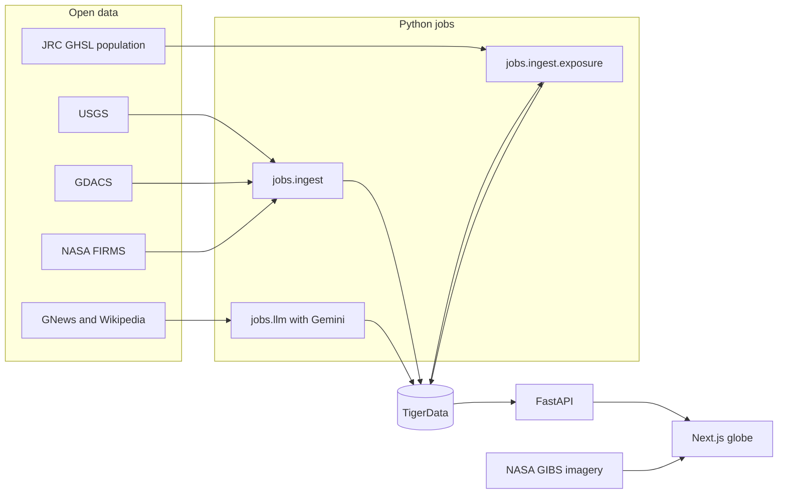

# Eye of Horus

In Egyptian myth, the Eye of Horus is the all-seeing eye that watched over the world and protected it. Eye of Horus, the project, aims to do the same for today's world. It is an interactive 3D globe that shows what is happening on Earth right now: earthquakes, wildfires, floods, cyclones, and volcanoes, alongside news on politics, conflict, technology, finance, and society.

Each event sits where it happened. Selecting one opens a briefing with its source link. For natural hazards, the briefing also shows a satellite view of the area and an estimate of how many people live nearby. Gemini links related stories, for example a news article that covers a specific earthquake. Readers can follow a story across sources without leaving the map.

The project was built for StormHacks 2026 and is aimed at disaster awareness and relief. Its satellite features use only open Earth observation data that anyone can download and read with free Python libraries.

> The repository and folder are still named `hypothesis-globe`, the project's working title.

## Features

- **Live globe.** A spinning Earth with country shapes, elevation relief, an animated ocean, and a real star backdrop. Event markers are grouped into clusters until you zoom in.
- **Layers.** Six groups of toggles: Conflict & Security, Politics & World, Economy & Tech, Humanitarian & Health, Culture & Lifestyle, and Natural Hazards. Each layer can be turned on or off, and filters for significance, time range, and country narrow what is shown.
- **Headlines, Explore, and My Feed.** Three views: a ranked list of the day's top stories, free exploration of the map, and a personalized feed based on the topics and places you choose.
- **Satellite view.** Every hazard briefing shows the day's NASA VIIRS true-color image around the event. Wildfire briefings add satellite fire detections drawn on top of that image.
- **Human impact score.** Each hazard gets a score of Low, Moderate, High, or Severe. The score combines the hazard's intensity with the number of people living within a set distance of it, counted from the JRC GHSL population grid.
- **Linked stories.** Gemini proposes connections between events, such as a news article and the disaster it reports on. Each connection comes with a written explanation and its sources.

## Tech stack

| Layer | Tools |
| --- | --- |
| Frontend | Next.js 16 (App Router), React 19, TypeScript, `react-globe.gl` and Three.js |
| API | FastAPI on Python 3.12+, reached through a Next.js `/api` proxy on the same origin as the page |
| Database | TigerData (managed Postgres with Timescale), accessed with `psycopg` 3 |
| AI | Google Gemini, used to tag, place, summarize, deduplicate, and link news events |
| Geospatial | `rasterio` and `numpy` for population counts, and the NASA GIBS Web Map Service for satellite imagery |
| Tests | Node's built-in test runner for the web app, and Python `unittest` with FastAPI `TestClient` for the API |

The browser only ever talks to `/api` on its own origin. TigerData and Gemini are called from the server, so no database URL or API key reaches the browser.

## Datasets

| Dataset | What it provides | Access |
| --- | --- | --- |
| [USGS earthquake feeds](https://earthquake.usgs.gov/earthquakes/feed/) | Earthquakes from the past day, with magnitude and location | Public domain GeoJSON, no key |
| [GDACS](https://www.gdacs.org/) | Alerts for earthquakes, cyclones, floods, volcanoes, droughts, and wildfires | Public API, no key |
| [NASA FIRMS](https://firms.modaps.eosdis.nasa.gov/) | Fire hotspots detected by the VIIRS sensor, grouped into clusters | Free `MAP_KEY` |
| [NASA GIBS](https://www.earthdata.nasa.gov/engage/open-data-services-software/earthdata-developer-portal/gibs-api) | Daily true-color images and fire-detection layers from the VIIRS sensor on the Suomi NPP and NOAA-20 satellites | Open Web Map Service, no key |
| [JRC GHSL GHS-POP R2023A](https://human-settlement.emergency.copernicus.eu/ghs_pop2023.php) | Population grid at about 1 km resolution, built from satellite imagery and census data | Free GeoTIFF tiles, CC BY 4.0 |
| [The GDELT Project](https://www.gdeltproject.org/) | Conflict events, via `data/backup_csvs/finalconflictCSV.csv` | Free project files |
| [GNews](https://gnews.io/) | Top headlines in nine categories | Free key, 100 requests a day |
| [Wikipedia Current events](https://en.wikipedia.org/wiki/Portal:Current_events) | Daily current-events stories | Free, CC BY-SA 4.0 |

## Workflow



1. **Ingest.** `python -m jobs.ingest` loads hazards from USGS, GDACS, and FIRMS. Each source is converted into the shared Event format defined in `packages/schema/` and saved to the database's `raw` and `mart` schemas. News scrapers in `jobs/ingest/scrapers/` pull GNews and Wikipedia headlines.
2. **Enrich and link.** Jobs in `jobs/llm/` use Gemini to tag each news story, place it on the map, and summarize it. They also merge duplicate stories and write connections between events to `mart.event_link`.
3. **Score human impact.** `python -m jobs.ingest.exposure` downloads the GHSL population tiles it needs into `data/cache/ghsl/`. For each hazard, it counts the people within a set distance and saves the score to `mart.hazard_exposure`.
4. **Serve.** FastAPI reads events, links, and impact scores from TigerData. If the database is unavailable, it falls back to the bundled JSON in `data/fixtures/`.
5. **Display.** The Next.js app requests `/api/*` and draws the globe. For each hazard briefing, it builds a NASA GIBS image request from the event's location and date.

## First-time setup

You need Node.js 20.9+, Python 3.12+, and Git. The events already live in the team's shared TigerData database, so a new machine only needs the app and a connection string. Do not recreate the schema or reload USGS, GDACS, or FIRMS.

### 1. Clone and create the env file

```bash
git clone https://github.com/tm1944/hypothesis-globe.git
cd hypothesis-globe
cp .env.example .env
```

On Windows PowerShell, use `Copy-Item .env.example .env` for the last line.

### 2. Add the database URL

Put the TigerData connection string in `DATABASE_URL` in `.env`. With the Tiger CLI signed in (`tiger auth login`), run:

```bash
tiger service list
tiger db uri SERVICE_ID --with-password
```

Paste the printed `postgresql://...` string into `.env`. If you leave `DATABASE_URL` empty, the app still runs, using the sample events in `data/fixtures/`.

The other keys are optional, and only the data jobs need them:

| Variable | Used for |
| --- | --- |
| `FIRMS_MAP_KEY` | Loading new NASA FIRMS fire hotspots |
| `GOOGLE_API_KEY` | Gemini enrichment and event linking in `jobs/llm/` |
| `GNEWS_API_KEY` | The GNews headline scraper |
| `INGEST_SECRET` | Authorizing `POST /ingest/run` on the API |

### 3. Start the API

The frontend expects the API on port 43124.

```bash
cd apps/api
python -m venv .venv
```

Activate the environment. On Windows, run `.venv\Scripts\activate`. On macOS or Linux, run `source .venv/bin/activate`.

```bash
pip install -r requirements.txt
uvicorn main:app --reload --host 127.0.0.1 --port 43124
```

Open http://127.0.0.1:43124/health. It should report `"database": "ok"`, or show that the API is serving fixture data if no database is configured.

### 4. Start the website

In a second terminal, from the repository root:

```bash
cd apps/web
npm ci
cp .env.example .env.local
npm run dev
```

The default `apps/web/.env.local` already points at the local API:

```dotenv
DATA_MODE=api
API_BASE_URL=http://127.0.0.1:43124
```

Open http://localhost:3000. Restart Next.js after changing `.env.local`. Never put `DATABASE_URL` or any API key in the frontend env file.

### 5. Optional: refresh the human impact scores

The scores are already in the shared database. To recompute them after new hazards arrive, run this from the repository root with the API's virtual environment active:

```bash
python -m jobs.ingest.apply_schema
python -m jobs.ingest.exposure
```

The first run downloads about 200 MB of GHSL population tiles into `data/cache/ghsl/`. Git ignores that folder, and later runs reuse the cached tiles.

### Run the tests

```bash
cd apps/api && python -m unittest discover -s tests -v
cd apps/web && npm test
```

Run `git diff --check` before you open a pull request. See [AGENTS.md](AGENTS.md) for contribution guidelines, [docs/architecture.md](docs/architecture.md) for the original design notes, and [apps/api/README.md](apps/api/README.md) for the API contract.

## Credits

These are the third-party data and assets the site shows. The same list appears as small credits in the bottom-right corner of the globe, in `apps/web/src/components/data-attribution.tsx`. Keep the two in sync. The linked docs have details, checksums, and rebuild steps.

- **Event feeds:** [USGS](https://earthquake.usgs.gov/earthquakes/feed/) earthquakes (public domain), [NASA FIRMS](https://firms.modaps.eosdis.nasa.gov/) fire hotspots, [GDACS](https://www.gdacs.org/) disaster alerts, [The GDELT Project](https://www.gdeltproject.org/) conflict events, [GNews](https://gnews.io/) headlines, and [Wikipedia Current events](https://en.wikipedia.org/wiki/Portal:Current_events) (CC BY-SA 4.0). Each event card also links to its own source.
- **Satellite imagery:** VIIRS true-color and active-fire layers from the Suomi NPP and NOAA-20 satellites, served by NASA's Global Imagery Browse Services ([GIBS](https://www.earthdata.nasa.gov/engage/open-data-services-software/earthdata-developer-portal/gibs-api)), part of NASA's Earth Science Data and Information System (ESDIS).
- **Population:** Schiavina, M., Freire, S., Carioli, A., MacManus, K. (2023), GHS-POP R2023A, GHS population grid multitemporal (1975–2030), European Commission, Joint Research Centre ([GHSL](https://human-settlement.emergency.copernicus.eu/ghs_pop2023.php)), CC BY 4.0.
- **Star backdrop:** Yale Bright Star Catalogue, 5th Revised Ed. (Hoffleit, D. & Warren Jr., W. H. 1991), distributed by the CDS, Strasbourg, as catalog [V/50](https://cdsarc.cds.unistra.fr/viz-bin/cat/V/50). `apps/web/scripts/build-star-catalog.mjs` copies the positions, magnitudes, and B−V colors unchanged into `apps/web/src/data/bright-stars.json`. This project uses data obtained from the CDS, Strasbourg, France. Star colors follow Mitchell Charity's blackbody color table ("What color is a blackbody?", vendian.org). See [apps/web/docs/vector-globe.md](apps/web/docs/vector-globe.md#starry-backdrop).
- **Country shapes:** [Natural Earth](https://www.naturalearthdata.com/) Admin 0 countries, 1:110m, public domain. See [apps/web/docs/vector-globe.md](apps/web/docs/vector-globe.md).
- **Elevation relief:** `earth-topology.png` from the [three-globe](https://github.com/vasturiano/three-globe) examples (MIT, © Vasco Asturiano). Its original source is not stated upstream. See [apps/web/public/textures/README.md](apps/web/public/textures/README.md).
- **Rendering:** [three.js](https://threejs.org/), [three-globe](https://github.com/vasturiano/three-globe), and [react-globe.gl](https://github.com/vasturiano/react-globe.gl), all MIT.
