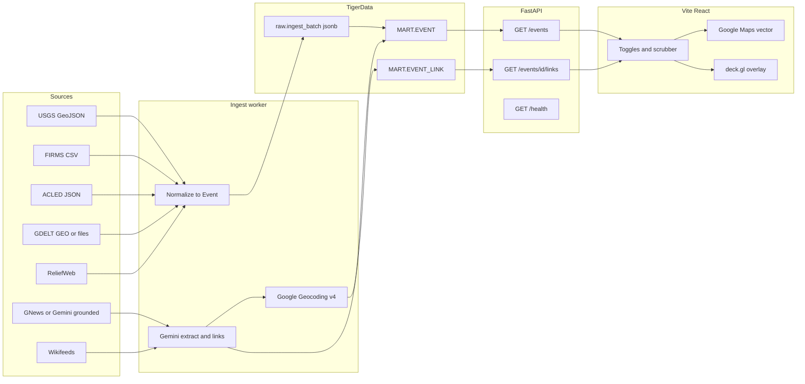

# Global events globe. Weekend architecture

Current product focus: Technology (`technology`), Government & Politics (`politics`), Finance (`finance`), and Society (`humanitarian`) are enabled by default. Technology is a new shared-schema layer ID; Society broadens the humanitarian display grouping to civic and social topics. Natural disasters are optional and off by default. See `apps/web/docs/globe-and-api.md` for the current implementation; the weekend proposal below is historical.
> Current team decision: TigerData/PostgreSQL replaces Snowflake. The Snowflake-specific setup and constraints below are historical. Use `apps/api/README.md` for the current connection and API contract; coordinate PostgreSQL DDL with Track B.

Globe update: the approved main-screen renderer is now `react-globe.gl` + Three.js, with local Earth imagery, auto-rotation, surface-coordinate selection, and event markers. The original Google Maps/deck.gl proposal below is retained for context, not the current renderer. No geocoding or backend request is needed to select latitude/longitude on the sphere.

Frontend update: the UI now uses Next.js App Router in `apps/web` instead of Vite. The browser calls same-origin `/api/*` routes, which serve fixtures or forward GET requests to FastAPI at `API_BASE_URL` (localhost port 43124 by default). See [local setup](../apps/web/README.md). Earlier Vite references below describe the original proposal; the Event/Link contracts and map plan remain applicable.

Constraint. The team has free Google API access and a TigerData database. Cost is out of scope. Do not drop TigerData or Gemini to save money. Still treat setup time, quotas, licenses, and demo quality as first-class risks.

Goal. A weekend hackathon demo for four students. An interactive world view with heatmap layers and discrete markers for significant events. Layer toggles. Time scrubber. Optional LLM edges that relate events.

## 1. Globe and map options

| Option | What you get | Tradeoff | Weekend fit |
| --- | --- | --- | --- |
| CesiumJS `1.146.0` | True 3D globe. Time-dynamic CZML. Apache-2.0 engine. | Heavy bundle. Ion assets need a token. Vite static-asset copy is easy to get wrong. | Strong globe. Slow first hour. |
| Mapbox GL JS `3.32.0` | Vector map. Native globe transition. Heatmap layer. | Proprietary license. Needs a Mapbox token. Not the Google stack. | Skip unless a Mapbox token is already live. |
| MapLibre GL JS `6.11.2` | Open vector map. OSM styles. | No Google basemap. Globe style exists. Tiles still need a host. | Fine fallback if Google Maps key setup slips. |
| deck.gl `9.4.0` | GPU heatmap. Scatterplot. Arc edges. Google overlay. | Not a basemap. You pair it with Maps or MapLibre. | Required for heatmaps on Google Maps. |
| globe.gl / Three.js `globe.gl 2.46.2`, `three 0.186.1` | Instant spherical globe. Built-in heatmaps and hex bins. | Custom earth, not Google tiles. Duplicate `three` versions break lighting. | Best spherical look if judges want a spinning globe. |
| Kepler.gl `3.2.6` stable, `3.3.0-alpha.15` latest npm | Full Kepler UI on MapLibre and deck.gl. | You embed an app, not a component. Hard to own layer UX. | Wrong shape for a custom demo. |
| Google Maps JS | Familiar basemap. Vector tilt. Places. Official 3D maps. | Built-in `HeatmapLayer` is deprecated. `Map3DElement` is a different surface. | Preferred basemap because Google access is already free. |

Sources.

- [cesium npm 1.146.0](https://www.npmjs.com/package/cesium)
- [CesiumJS quickstart](https://cesium.com/learn/cesiumjs-learn/cesiumjs-quickstart/)
- [mapbox-gl npm 3.32.0](https://www.npmjs.com/package/mapbox-gl)
- [maplibre-gl npm 6.11.2](https://www.npmjs.com/package/maplibre-gl)
- [deck.gl npm 9.4.0](https://www.npmjs.com/package/deck.gl)
- [deck.gl HeatmapLayer](https://deck.gl/docs/api-reference/aggregation-layers/heatmap-layer)
- [deck.gl Google Maps overlay](https://deck.gl/docs/api-reference/google-maps/overview)
- [globe.gl npm 2.46.2](https://www.npmjs.com/package/globe.gl)
- [three npm 0.186.1](https://www.npmjs.com/package/three)
- [kepler.gl npm](https://www.npmjs.com/package/kepler.gl)
- [Google Maps HeatmapLayer deprecated](https://developers.google.com/maps/documentation/javascript/reference/3.64/visualization)
- [Photorealistic 3D Maps](https://mapsplatform.google.com/resources/blog/access-3d-maps-in-maps-javascript-api-starting-today/)
- [Vector map features](https://developers.google.com/maps/documentation/javascript/vector-map)

### MVP recommendation

Use Google Maps JavaScript API as a vector basemap. Overlay deck.gl `HeatmapLayer` and `ScatterplotLayer` through `GoogleMapsOverlay`. Drive the map from `@vis.gl/react-google-maps`. Store events in TigerData. Reason over them with Gemini. Geocode news with Geocoding API v4.

Why this stack.

- Google Maps and Gemini already fit the free Google access.
- deck.gl heatmaps stay supported. Google `HeatmapLayer` does not.
- Vector maps support tilt and heading. Interleaved overlay can sit in the same WebGL scene.
- Four people can split UI, ingest, API, and LLM against one Event contract.
- A spherical globe is optional. `react-globe.gl` can replace the canvas later if the same Event JSON is used.

What not to do on Saturday morning.

- Do not use `google.maps.visualization.HeatmapLayer`. Google marked it deprecated in May 2025 and slated it unavailable in a Maps JS release from May 2026.
- Do not start on `Map3DElement` photorealistic 3D. It is a separate `maps3d` library. deck.gl `GoogleMapsOverlay` is documented against the classic `Map` plus `WebGLOverlayView`, not `Map3DElement`.
- Do not call TigerData or Gemini from the browser.

**Guess.** A clean vector map plus GPU heatmap will read as a globe product if the camera starts zoomed out and copy says “global events.” A spinning Three.js earth is nicer in photos. Swap only if the overlay path is already green.

## 2. Heatmap, markers, and time scrubber

Keep one in-memory Event array on the client. Derive every visual from filters. Do not give each source its own map instance.

Layer model.

- `layerId` is one of `technology`, `earthquake`, `wildfire`, `conflict`, `politics`, `terror`, `finance`, `humanitarian`, `news`.
- Each layer has `enabled`, `mode` (`heatmap` or `markers` or `both`), and `weightField`.
- Time state is an object with `startIso`, `endIso`, and boolean `play`.
- Visible events equal `events` filtered by enabled layers and `occurredAt` inside the window.

Rendering.

- Heatmap uses one `HeatmapLayer` per enabled layer, or one layer with a `getWeight` of zero for hidden rows. Prefer separate layer ids so toggles set `visible` to false rather than rebuilds.
- Markers use `ScatterplotLayer`. Click opens a React panel. Do not spawn Google `Marker` objects for thousands of fires.
- Related-event edges use `ArcLayer` from the same filtered set.
- Time scrubbing should filter arrays in the parent and pass new `data` props. deck.gl will update attributes. Avoid remounting `Map`.

How toggles stay clean.

- One `LayerState` object in React state.
- URL query mirrors `layers` and `t`. Judges can deep-link a view.
- A layer that is off still exists in config. Its deck.gl layer gets `visible` set to false or empty `data`.
- Cap client payload. **Guess.** About 5k markers plus one heatmap stays smooth. USGS plus FIRMS can exceed that. Aggregate heatmap points server-side. Keep markers for `significance >= threshold`.

Empty, loading, error.

- Empty window shows a banner. “No events in this range.”
- Loading shows a skeleton map and disables the scrubber.
- API failure shows cached fixtures if present, else a hard error with the failing source name.

## 3. Event ingestion

Normalize every source into the Event contract before `mart.event`. Keep raw JSON copies in `raw.ingest_batch`.

### USGS earthquakes

- Feed. Real-time GeoJSON summaries, plus FDSN query for windows. [Catalog API](https://earthquake.usgs.gov/fdsnws/event/1/). [GeoJSON feed](https://earthquake.usgs.gov/earthquakes/feed/v1.0/geojson.php).
- Geo. Point `[longitude, latitude, depth]`.
- Limits. Query `limit` is 1 to 20000. Over that returns HTTP 400. USGS asks automated displays to prefer the real-time feeds.
- License. USGS scientific data are generally public domain. [USGS data policy FAQ](https://www.usgs.gov/faqs/what-usgs-policy-release-scientific-data-are-any-usgs-products-restricted). [Data licensing](https://www.usgs.gov/data-management/data-licensing).
- Weekend use. First live layer. No geocoding.

### NASA FIRMS wildfires

- Feed. Area CSV API with a free `MAP_KEY`. [Area API](https://firms.modaps.eosdis.nasa.gov/api/area/). [Map key](https://firms.modaps.eosdis.nasa.gov/api/map_key).
- Geo. `latitude`, `longitude` per hotspot. Not a named fire event.
- Limits. 5000 transactions per 10 minutes. A 7-day request can count as several transactions. World VIIRS can return 30000 to 100000+ rows per day. [FIRMS academy](https://firms.modaps.eosdis.nasa.gov/content/academy/data_api/firms_api_use.html).
- License. NASA asks credit as “NASA FIRMS” and a LANCE acknowledgment for papers. [FIRMS FAQ](https://www.earthdata.nasa.gov/data/tools/firms/faq).
- Weekend use. Heatmap only. Cluster or sample before markers.

### ACLED conflict, protest, political violence

- Feed. OAuth against `https://acleddata.com/api/acled/read`. [Auth](https://acleddata.com/api-authentication). [Endpoint](https://acleddata.com/api-documentation/acled-endpoint).
- Geo. `latitude`, `longitude` in EPSG:4326 to four decimals. Also `geo_precision`, `country`, `location`.
- Access. myACLED account required. Older public FAQ described six downloads per year for public users plus weekly real-time data. Confirm current TOU before a public demo. [2023 FAQ PDF](https://acleddata.com/sites/default/files/wp-content-archive/uploads/2023/07/ACLED_Terms-of-Use-Attribution-Access_FAQs_2023.pdf).
- Weekend use. Best politics and terror-adjacent points if the account is approved before Saturday. If not, ship GDELT plus fixtures.

### GDELT news and coded events

- Feed. Free project files and GEO 2.0 / DOC 2.0 HTTP APIs. [GDELT data](https://gdeltproject.org/data.html). [GEO 2.0](https://blog.gdeltproject.org/gdelt-geo-2-0-api-debuts/). Event codebook has `Actor1Geo_Lat` / `Actor1Geo_Long` and Action geo. [Codebook PDF](https://data.gdeltproject.org/documentation/GDELT-Event_Codebook-V2.0.pdf).
- Geo. Machine-assigned centroids. Country-level matches still emit a lat/lng at the country centroid. Filter `Actor1Geo_Type` if you need city-scale points.
- License. Core GDELT project data are described as free and open. GDELT Cloud products have a separate no-redistribute policy. Use the project APIs and files, not Cloud, unless you have that license. [GDELT Cloud AUP](https://gdeltcloud.com/acceptable-use).
- Quality. High volume. Noisy geo. Good for density. Bad for a single “this war is here” pin without review.

### ReliefWeb humanitarian

- Feed. Public JSON. `appname` required. [Help](https://reliefweb.int/help/api). [Fields](https://apidoc.reliefweb.int/fields-tables).
- Geo. Country objects. `country.iso3`, `country.name`, `country.primary`. No reliable event lat/lng.
- Limits. 1000 entries per call. 1000 calls per day.
- Weekend use. Geocode `primary_country` to a country centroid. Mark `geoPrecision` as `country`.

### NewsAPI, GNews, mediastack

- NewsAPI Developer. 100 requests/day. 24-hour delay. Dev and test only. No production publish on the free plan. [Pricing](https://newsapi.org/pricing).
- GNews. Search API. Free plan 100 requests/day and 1 request/second. `max` 10 on free. `country` is source country, not story place. [Search docs](https://docs.gnews.io/endpoints/search-endpoint).
- mediastack Free. 100 calls/month. Delayed. [Pricing](https://mediastack.com/pricing).
- Geo. None of these return stable coordinates. Titles have place names at best.
- Weekend use. Prefer Gemini with Search grounding for a small curated news set, because Google access is already available. Keep GNews as a structured headline backup. Avoid NewsAPI if the demo will be shown outside localhost.

### Wikipedia current events

- Feed. Wikifeeds featured and news. Example path on English Wikipedia REST. `/api/rest_v1/feed/featured/{yyyy}/{mm}/{dd}` includes news. [Wikifeeds](https://wikitech.wikimedia.org/wiki/Wikifeeds). [Wikimedia APIs](https://api.wikimedia.org/wiki/Core_REST_API).
- Geo. None.
- Limits. Unidentified clients about 10 req/min. Compliant `User-Agent` about 200 req/min. [Rate limits](https://www.mediawiki.org/wiki/Wikimedia_APIs/Rate_limits).
- Weekend use. Seed LLM entity extraction. Then geocode.

### Geocoding

Prefer Google, in this order.

1. Skip geocoding when the source already has lat/lng (USGS, FIRMS, ACLED).
2. Google Geocoding API v4 for addresses and “City, Country” strings. [v4 overview](https://developers.google.com/maps/documentation/geocoding/geocoding-v4-overview).
3. Places API (New) Text Search when the string is a landmark or “something in X.” [Text Search](https://developers.google.com/maps/documentation/javascript/place-search).
4. Cached country-centroid table for ReliefWeb ISO3.
5. Nominatim public API only for tiny manual lookups. Hard cap 1 req/s. No bulk jobs. Identify a real User-Agent. [Nominatim policy](https://operations.osmfoundation.org/policies/nominatim/).

Store `geoSource` as `native`, `google_geocode`, `google_places`, `centroid`, or `llm_hint`. Never write `llm_hint` as the only lat/lng without a Google verify pass.

## 4. Storage

| Store | Fit | Weekend verdict |
| --- | --- | --- |
| TigerData | Postgres plus Timescale and PostGIS. Shared database. JSONB raw payloads. SQL over events and edges. | Keep it. This is the store of record. |
| SQLite | Zero ops. One file of fixtures. | Client and ingest scratch. Not the shared source of truth. |
| DuckDB | Fast local parquet or CSV. | Great for FIRMS downsample notebooks. Not the API backend. |
| BigQuery | Native GDELT public datasets. | Extra cloud. GDELT HTTP plus TigerData is enough. |

TigerData is the weekend store because the team already has an account, four laptops can share one database, and the story is news to database to LLM.

Weekend shape. See [sql/001_init.sql](../sql/001_init.sql).

- Schemas `raw` and `mart` on the Tiger service database.
- `raw.ingest_batch` with `source`, `pulled_at`, `payload jsonb`.
- `mart.event` for the shared map columns, plus one kind table per hazard.
- `mart.wildfire_hotspot` as the only hypertable.
- `mart.event_link` for LLM edges.
- Python connector `psycopg` 3. The URL lives in `DATABASE_URL`.

Setup-time risks, not cost risks.

- A missing or pooled-vs-direct URL can block the first connection.
- Putting `DATABASE_URL` in the frontend will leak the database.
- If TigerData is not reachable, serve `data/fixtures/events.json` from FastAPI and keep the same insert path for when it returns.

## 5. LLM reasoning

Use Gemini. The team already has Google API access.

| Job | Model | Why |
| --- | --- | --- |
| Entity extract, classify, geocode hints | `gemini-3.5-flash-lite` | Structured output. High volume headlines. [Model card](https://ai.google.dev/gemini-api/docs/models/gemini-3.5-flash-lite) |
| Related-event edges, short judge-facing rationale | `gemini-3.8-flash` | Stronger reasoning. Still Flash latency. [Model card](https://ai.google.dev/gemini-api/docs/models/gemini-3.8-flash) |
| Optional live news assist | Same models plus Search grounding | Reduces stale NewsAPI plans. Grounding has its own request caps. [Pricing](https://ai.google.dev/gemini-api/docs/pricing) |

Do not start new work on `gemini-2.5-flash`. Google now points new projects at 3.5 Flash-Lite or 3.8 Flash. [2.5 Flash note](https://ai.google.dev/gemini-api/docs/models/gemini-2.5-flash).

SDK. `google-genai` `2.8.0` on PyPI as of the June 2026 wheel checked for this note. Confirm `pip index versions google-genai` on Friday. [PyPI](https://pypi.org/project/google-genai/).

### Tasks

Entity extraction. Headline plus body or lede in. JSON out with `label`, `eventType`, `placeText`, `actors[]`, `confidence`.

Geocoding assist. Model may emit `placeText` only. Server calls Google Geocoding. If the model also emits lat/lng, treat it as a hint. Accept it only if a Google result lands within a tolerance. **Guess.** 50 km for city, 250 km for region.

Related-event edges. Given event A and a candidate set of 20 nearby-in-time events, emit `sourceId`, `targetId`, `relation`, `confidence`, `rationale`. Persist in `MART.EVENT_LINK`. Draw as arcs.

### Failure modes

- Hallucinated coordinates. “Kyiv” maps to a random ocean point.
- Country centroid presented as a street.
- False causality. An earthquake and a nearby protest become “caused by.”
- Stale knowledge cutoff used as a fact. 3.5 Flash-Lite docs listed a January 2025 cutoff on the 2.5-era card family. Prefer grounded or retrieved text for “what happened today.”
- Duplicate events from GDELT plus news plus Wikipedia.

### Fast evaluation

Ship a 30-row gold file in `eval/geo_gold.json`.

- 10 native-geo rows must stay within 1 km of source coords after the pipeline.
- 10 place-name rows must match Google’s first geocode, not the model’s raw coords.
- 10 relation pairs with human labels `related` or `unrelated`. Target precision over recall. Show only `confidence >= 0.7` on the globe.
- Print a table in the README. Judges like a red-team slide.

Never display an edge labeled “caused” unless a human checked it. Use `co_occurs`, `same_place`, `same_topic`, or `reported_together`.

## 6. System diagram, API, repo



Fixture path. `GET /events` can read `data/fixtures/events.json` when `DATABASE_URL` is unset or `?fixture=1`.

### API shape

`GET /events`

Query params.

- `types`. Comma list of `layerId`.
- `start`. ISO-8601 inclusive.
- `end`. ISO-8601 exclusive.
- `minSignificance`. Number. Default 0.
- `bbox`. Optional `minLng,minLat,maxLng,maxLat`.
- `limit`. Default 2000. Max 8000.
- `cursor`. Opaque.

Response.

```json
{
  "generatedAt": "2026-10-03T19:00:00Z",
  "sourceStatus": { "usgs": "ok", "firms": "ok", "database": "ok" },
  "events": [],
  "nextCursor": null
}
```

`GET /events/{id}`

`GET /events/{id}/links`

`POST /ingest/run` (protect with a shared secret)

`GET /health` returns warehouse ping and last ingest time.

Event object every workstream shares.

```json
{
  "id": "usgs:us7000example",
  "source": "usgs",
  "sourceUrl": "https://earthquake.usgs.gov/...",
  "layerId": "earthquake",
  "title": "M 6.2 - 15 km SW of Example",
  "summary": null,
  "occurredAt": "2026-10-03T12:04:11Z",
  "updatedAt": "2026-10-03T12:10:00Z",
  "lng": -122.4,
  "lat": 37.8,
  "altM": -10000,
  "geoPrecision": "point",
  "geoSource": "native",
  "weight": 6.2,
  "significance": 80,
  "entities": [{ "type": "place", "text": "Example", "confidence": 0.9 }],
  "rawRef": "RAW.INGEST_BATCH:uuid"
}
```

Link object.

```json
{
  "id": "link:usgs:us7000example:gdelt:123",
  "sourceId": "usgs:us7000example",
  "targetId": "gdelt:123",
  "relation": "reported_together",
  "confidence": 0.74,
  "rationale": "Same province and 6 hour window.",
  "model": "gemini-3.8-flash"
}
```

### Repo layout

```
/
  README.md
  data/fixtures/events.json
  data/fixtures/links.json
  eval/geo_gold.json
  packages/schema/event.schema.json
  apps/web/                 Vite React map
  apps/api/                 FastAPI
  jobs/ingest/              USGS FIRMS GDELT loaders
  jobs/llm/                 extract and link
  sql/001_init.sql          TigerData DDL
```

Monorepo is optional. Two folders `web/` and `api/` is enough if schema JSON lives at the root.

## 7. Four-student work split

Share `packages/schema/event.schema.json` and the fixture files first. Nobody waits on a live key.

### A. Map UI

Interface. Consumes `GET /events` and `GET /events/{id}/links`. Owns `LayerState`.

Delivers. Vector map, heatmap, markers, toggles, scrubber, empty and error states.

Blocked by. Nothing if fixtures exist.

### B. Ingest and TigerData

Interface. Writes `MART.EVENT` and `RAW.INGEST_BATCH`. Emits the same JSON the API reads.

Delivers. `sql/001_init.sql`, connector env, USGS and FIRMS loaders, fixture exporter.

Blocked by. `DATABASE_URL`. Use local JSON until the database answers.

### C. API

Interface. Reads MART or fixtures. Serves the routes above. Never reshapes field names.

Delivers. FastAPI, health, time filter, significance filter, CORS for the Vite origin.

Blocked by. Schema only.

### D. LLM and geocode

Interface. Reads unlocated or news-like events. Writes `placeText`, verified `lat`/`lng`, and `EVENT_LINK` rows.

Delivers. Gemini extract, Google Geocoding verify, 30-row eval table, one demo arc set.

Blocked by. Google keys. Can run extract against fixtures offline if the key is late.

Daily handshake. A dumps a screenshot. B dumps row counts. C dumps `curl` of `/events`. D dumps eval precision.

## 8. Critical path versus nice-to-have

Critical path. Demo dies without these.

- Fixture Events on a map with two layer toggles.
- USGS live or cached quakes with native coords.
- Time window that changes visible points.
- FastAPI in front of TigerData or fixtures.
- One Google key path that loads the basemap.

Should have if Saturday stays green.

- FIRMS heatmap.
- Gemini extract on Wikipedia or GNews headlines.
- Google-verified geocodes for those headlines.
- A few related-event arcs with non-causal labels.

Nice-to-have.

- ACLED if the account is already approved.
- Photorealistic `Map3DElement`.
- globe.gl dual renderer.
- Gemini calls issued from inside the database.
- Finance ticks. There is no simple free global “finance event” geo feed. **Guess.** Use a curated fixture of market-moving headlines and geocode the companies’ HQs.
- Auth, accounts, realtime websockets.

Biggest demo-risk items.

1. Google Maps key restrictions (HTTP referrer, APIs not enabled, vector `mapId` missing).
2. deck.gl overlay blank on raster fallback or missing WebGL2.
3. TigerData login lock or a sleeping service during the live talk.
4. FIRMS volume freezing the tab.
5. LLM arcs that look fabricated.
6. News APIs with no coordinates and a geocoder quota spike.
7. ACLED TOU or account not ready.
8. Deprecated HeatmapLayer if someone follows old Maps samples.

Mitigations.

- Pre-enable Maps JavaScript API, Geocoding API, Places API (New), and Generative Language API on Friday.
- Create a Cloud map ID for vector tiles before Saturday.
- Keep a recorded `events.json` from Friday night.
- `AUTO_RESUME` plus a warmup `SELECT 1` in `/health` before the room fills.
- Sample FIRMS to 5k heatmap points.
- Hide links below confidence 0.7.
- Do not click ingest during the pitch.

## 9. Versions checked on 2026-10-03

Verified against public registries or vendor docs on this date.

| Package | Version | URL |
| --- | --- | --- |
| cesium | 1.146.0 | https://www.npmjs.com/package/cesium |
| mapbox-gl | 3.32.0 | https://www.npmjs.com/package/mapbox-gl |
| maplibre-gl | 6.11.2 | https://www.npmjs.com/package/maplibre-gl |
| deck.gl and `@deck.gl/google-maps` | 9.4.0 | https://www.npmjs.com/package/deck.gl |
| globe.gl | 2.46.2 | https://www.npmjs.com/package/globe.gl |
| react-globe.gl | 2.38.0 | https://www.npmjs.com/package/react-globe.gl |
| three | 0.186.1 | https://www.npmjs.com/package/three |
| kepler.gl | 3.2.6 stable changelog, 3.3.0-alpha.15 npm | https://www.npmjs.com/package/kepler.gl |
| vite | 8.3.2 | https://www.npmjs.com/package/vite |
| react | 19.3 announced 2026-09-09 | https://react.dev/blog/2026/09/09/react-19-3 |
| @vis.gl/react-google-maps | 1.10.1 | https://www.npmjs.com/package/@vis.gl/react-google-maps |
| fastapi | 0.142.2 | https://pypi.org/project/fastapi/ |
| psycopg | 3.2.13 | https://pypi.org/project/psycopg/ |
| google-genai | 2.8.0 (wheel date 2026-06-03) | https://pypi.org/project/google-genai/ |
| Gemini extract | `gemini-3.5-flash-lite` | https://ai.google.dev/gemini-api/docs/models/gemini-3.5-flash-lite |
| Gemini links | `gemini-3.8-flash` | https://ai.google.dev/gemini-api/docs/models/gemini-3.8-flash |

**Guess.** Pin exact `react` / `react-dom` patch numbers at `npm view react version` on Friday. The 19.3 blog post used a canary string in some snippets.

Maps JavaScript API is versioned by Google’s weekly channel, not a single npm package. Load it through `@vis.gl/react-google-maps` `APIProvider`.

## Recommended pin list for `package.json` / `pyproject`

Frontend.

- `vite@8.3.2`
- `react` and `react-dom` at current 19.3.x
- `@vis.gl/react-google-maps@1.10.1`
- `deck.gl@9.4.0`
- `@deck.gl/google-maps@9.4.0`
- `@deck.gl/aggregation-layers@9.4.0`

Backend.

- `fastapi[standard]==0.142.2`
- `psycopg[binary]==3.2.13`
- `google-genai==2.8.0` or newer patch if pip shows one
- Python 3.12

Optional globe swap.

- `react-globe.gl@2.38.0`
- `three@0.186.1` (dedupe so globe.gl does not pull a second copy)
